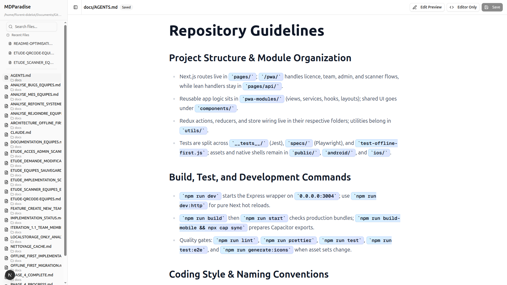

<div align="center">


# 📝 MDParadise

**The beautiful Markdown editor you can launch anywhere**

[](https://nextjs.org/)
[](https://react.dev/)
[](https://ui.shadcn.com/)
[](https://www.typescriptlang.org/)
[](LICENSE)
[]()

*Edit your Markdown files with a gorgeous split-view interface, live preview, WYSIWYG editing, and syntax highlighting. Launch it from any directory in seconds.*

[Features](#-features) • [Quick Start](#-quick-start) • [Installation](#-installation) • [Usage](#-usage) • [Contributing](#-contributing)



</div>

---

## ✨ Features

### 🎨 Modern UI/UX
- **Dual editing modes**: CodeMirror editor + Live Markdown preview
- **WYSIWYG editing**: Edit directly in the preview with visual feedback
- **Resizable panels**: Adjust editor and preview size to your liking
- **Three view modes**: Both panels / Editor only / Preview only
- **Mobile responsive**: Full tablet and mobile support
- **Dark theme**: One Dark theme for the editor
- **Multilingual**: 8 languages supported (FR, EN, MG, DE, ZH-CN, ES, IT, RU)

### 📝 Powerful Editing
- **Syntax highlighting**: CodeMirror with markdown support
- **Live preview**: Instant rendering as you type
- **Markdownizer**: Convert formatted text (emojis, checkboxes) to clean markdown
- **Copy code blocks**: One-click copy button on all code blocks
- **Anchor navigation**: Functional table of contents links
- **Auto-save detection**: Warns before losing unsaved changes
- **Keyboard shortcuts**: Ctrl+S / Cmd+S to save

### 📂 File Management
- **Recursive file discovery**: Finds all .md files in subdirectories
- **File search**: Quick filter to find your files
- **Recent files**: Quick access to your 3 most recent files
- **Auto-refresh**: Detects new files without page reload
- **State persistence**: Remembers your last file and settings

### 🚀 Developer Experience
- **npm CLI**: Single command to launch from any directory
- **Auto port detection**: Runs multiple instances without conflicts
- **Instance switcher**: Navigate between multiple instances from the sidebar
- **Hot reload**: Next.js dev server with instant updates
- **TypeScript**: Full type safety
- **Modern stack**: Next.js 16, React 19, Tailwind CSS 4

---

## 🚀 Quick Start

> **Windows users:** See the [Windows Installation Guide](WINDOWS.md) for PowerShell-specific instructions.

### One-time setup (Linux/macOS)

```bash
# Clone the repository
git clone https://github.com/Flo976/mdparadise.git
cd mdparadise

# Build the project
./build-cli.sh

# Install globally
cd frontend
npm link
```

### One-time setup (Windows)

```powershell
# Clone the repository
git clone https://github.com/Flo976/mdparadise.git
cd mdparadise

# Build the project
.\build-cli.ps1

# Install globally
cd frontend
npm link
```

### Launch MDParadise

```bash
# In your markdown directory
cd ~/Documents/notes
mdparadise

# Or specify a directory
mdparadise ~/Documents/notes

# Custom port
mdparadise --port 3000

# Don't open browser automatically
mdparadise --no-open
```

---

## 📦 Installation

### Prerequisites

- **Node.js** 18+ (recommended: 20 LTS or 23+)
- **npm** 9+
- **Git** (for cloning the repository)

> **📘 Platform-specific guides:**
> - **Windows:** See [WINDOWS.md](WINDOWS.md) for detailed PowerShell instructions
> - **Linux/macOS:** Follow the instructions below

### Step-by-step (Linux/macOS)

1. **Clone the repository**
   ```bash
   git clone https://github.com/Flo976/mdparadise.git
   cd mdparadise
   ```

2. **Run the build script**
   ```bash
   ./build-cli.sh
   ```
   This will:
   - Clean the `.next` directory
   - Build the Next.js app in production mode
   - Prepare the CLI for installation

3. **Install globally**
   ```bash
   cd frontend
   npm link
   ```
   This creates the `mdparadise` command available system-wide.

4. **Verify installation**
   ```bash
   mdparadise --version
   mdparadise --help
   ```

### Step-by-step (Windows)

1. **Clone the repository** (in PowerShell)
   ```powershell
   git clone https://github.com/Flo976/mdparadise.git
   cd mdparadise
   ```

2. **Run the build script**
   ```powershell
   .\build-cli.ps1
   ```
   If you get an execution policy error, run: `Set-ExecutionPolicy -ExecutionPolicy RemoteSigned -Scope CurrentUser`

3. **Install globally**
   ```powershell
   cd frontend
   npm link
   ```
   You may need to run PowerShell as Administrator.

4. **Verify installation** (after reopening PowerShell)
   ```powershell
   mdparadise --version
   mdparadise --help
   ```

For detailed Windows troubleshooting, see [WINDOWS.md](WINDOWS.md).

### Uninstall

```bash
cd mdparadise/frontend
npm unlink
```

---

## 🎯 Usage

### Basic Commands

```bash
# Launch in current directory
mdparadise

# Launch in specific directory
mdparadise ~/Documents/notes
mdparadise /path/to/markdown/files

# Specify port
mdparadise --port 3000

# Don't auto-open browser
mdparadise --no-open

# Show help
mdparadise --help

# Show version
mdparadise --version
```

### Multiple Instances

MDParadise automatically detects port conflicts and finds the next available port. You can also navigate between instances directly from the sidebar.

```bash
# Terminal 1
cd ~/project-a
mdparadise
# → Starts on port 4445

# Terminal 2
cd ~/project-b
mdparadise
# → Automatically starts on port 4446

# Terminal 3
cd ~/project-c
mdparadise
# → Automatically starts on port 4447
```

**Instance Switcher**: When multiple instances are running, a footer appears in the sidebar showing:
- All active MDParadise instances with their ports and directories
- Current instance indicator (✓)
- Click any instance to open it in a new tab
- Auto-refresh every 10 seconds
- Works on localhost, LAN, and remote access

For more details, see [MULTIPLE_INSTANCES.md](MULTIPLE_INSTANCES.md).

### Keyboard Shortcuts

| Shortcut | Action |
|----------|--------|
| `Ctrl+S` / `Cmd+S` | Save current file |
| `Ctrl+F` / `Cmd+F` | Search in editor |
| `Esc` | Close mobile menu |

### View Modes

Click the view toggle button to switch between:
- **Both**: Editor + Preview side-by-side (default)
- **Preview Only**: Full-width preview
- **Editor Only**: Full-width editor

### WYSIWYG Editing

1. Open a markdown file
2. Click **"Edit Preview"** button
3. Edit directly in the preview with visual feedback
4. Changes are automatically converted back to markdown
5. Click **"Read Only"** to return to normal preview

### Markdownizer

Convert formatted text with emojis and checkboxes into clean markdown:

1. Click the **"Markdownizer"** button in the toolbar
2. Paste your formatted text (from notes, documents, etc.)
3. Text is automatically converted to proper markdown:
   - `☐ Task` → `- [ ] Task` (unchecked checkbox)
   - `✅ Done` → `- [x] Done` (checked checkbox)
   - `📋 Title` → `## 📋 Title` (emoji heading)
   - Indented lists → Proper markdown lists
4. The converted markdown replaces your editor content

For examples, see [TEST_MARKDOWNISER.md](TEST_MARKDOWNISER.md).

### Language Selection

Click the flag icon in the header to switch between languages:
- Français (FR)
- English (EN)
- Malagasy (MG)
- Deutsch (DE)
- 简体中文 (ZH-CN)
- Español (ES)
- Italiano (IT)
- Русский (RU)

Your language preference is saved automatically.

---

## 🏗️ Architecture

### Tech Stack

```
┌─────────────────────────────────────────┐
│  Frontend (React + TypeScript)          │
│  - CodeMirror Editor                    │
│  - Markdown Preview                     │
│  - shadcn/ui Components                 │
│  - Tailwind CSS 4                       │
│  - i18n (8 languages)                   │
│  - Instance Switcher                    │
│  - Markdownizer                         │
└──────────────┬──────────────────────────┘
               │
┌──────────────▼──────────────────────────┐
│  Next.js 16 (App Router)                │
│  - /api/files (file listing)            │
│  - /api/file/* (read/write)             │
│  - /api/instances (multi-instance)      │
│  - Server-side file operations          │
└──────────────┬──────────────────────────┘
               │
┌──────────────▼──────────────────────────┐
│  Node.js File System                    │
│  - Read/Write markdown files            │
│  - Recursive directory scanning         │
│  - File metadata (size, mtime)          │
└─────────────────────────────────────────┘
```

### Project Structure

```
mdparadise/
├── frontend/
│   ├── app/
│   │   ├── api/
│   │   │   ├── files/
│   │   │   │   └── route.ts        # GET /api/files
│   │   │   ├── file/
│   │   │   │   └── [...filepath]/
│   │   │   │       └── route.ts    # GET/POST /api/file/*
│   │   │   └── instances/
│   │   │       └── route.ts        # GET /api/instances
│   │   ├── page.tsx                # Main page
│   │   ├── layout.tsx              # Root layout
│   │   └── globals.css             # Global styles
│   ├── components/
│   │   ├── markdown-editor/
│   │   │   ├── editor-layout.tsx   # Main layout
│   │   │   ├── editor.tsx          # CodeMirror editor
│   │   │   ├── preview.tsx         # Markdown preview
│   │   │   ├── wysiwyg-editor.tsx  # WYSIWYG editor
│   │   │   ├── file-sidebar.tsx    # File browser (desktop)
│   │   │   ├── file-list-content.tsx # File list (mobile)
│   │   │   └── instance-switcher.tsx # Instance navigation
│   │   ├── language-selector.tsx   # i18n language picker
│   │   └── ui/                     # shadcn/ui components
│   ├── lib/
│   │   ├── api/
│   │   │   └── client.ts           # API client
│   │   ├── i18n/
│   │   │   ├── config.ts           # i18n configuration
│   │   │   └── provider.tsx        # i18n provider
│   │   ├── persistence.ts          # LocalStorage utils
│   │   └── markdown-formatter.ts   # Markdownizer
│   ├── locales/
│   │   ├── fr.json                 # French translations
│   │   ├── en.json                 # English translations
│   │   └── ...                     # Other languages
│   ├── types/
│   │   └── index.ts                # TypeScript types
│   ├── bin/
│   │   └── mdparadise.js           # CLI entry point
│   ├── package.json
│   └── next.config.ts
├── build-cli.sh                    # Build script (Linux/macOS)
├── build-cli.ps1                   # Build script (Windows)
├── CLAUDE.md                       # AI context file
├── MULTIPLE_INSTANCES.md           # Multi-instance guide
├── TEST_MARKDOWNISER.md            # Markdownizer examples
├── LICENSE
├── .gitignore
└── README.md
```

### API Endpoints

#### GET /api/files
Returns list of all markdown files in the base directory.

**Response:**
```json
{
  "success": true,
  "files": [
    {
      "name": "README.md",
      "path": "README.md",
      "dir": ".",
      "size": 1234,
      "mtime": 1698765432000
    }
  ],
  "base_dir": "/home/user/notes"
}
```

#### GET /api/file/:filepath
Returns content of a specific file.

**Response:**
```json
{
  "success": true,
  "content": "# Hello\n\nThis is markdown content.",
  "html": "",
  "path": "README.md"
}
```

#### POST /api/file/:filepath
Saves content to a file.

**Request:**
```json
{
  "content": "# Updated content"
}
```

**Response:**
```json
{
  "success": true,
  "message": "File saved successfully"
}
```

#### GET /api/instances
Returns list of all running MDParadise instances.

**Response:**
```json
{
  "success": true,
  "instances": [
    {
      "port": 4445,
      "baseDir": "/home/user/notes",
      "url": "http://localhost:4445",
      "isCurrent": true
    },
    {
      "port": 4446,
      "baseDir": "/home/user/docs",
      "url": "http://localhost:4446",
      "isCurrent": false
    }
  ],
  "currentPort": 4445
}
```

---

## 🔧 Development

### Setup for development

```bash
# Clone and install
git clone https://github.com/Flo976/mdparadise.git
cd mdparadise/frontend
npm install

# Run development server
npm run dev

# Or with custom base directory
MDPARADISE_BASE_DIR=~/Documents/notes npm run dev
```

### Build for production

```bash
npm run build
```

### Environment Variables

- `MDPARADISE_BASE_DIR`: Directory to serve markdown files from (defaults to `cwd`)
- `PORT`: Port number (defaults to `4445`)

---

## 🐛 Troubleshooting

> **Windows users:** See [WINDOWS.md](WINDOWS.md) for Windows-specific troubleshooting (PATH issues, execution policy, usernames with spaces, etc.)

### Port already in use

MDParadise automatically detects and uses the next available port. If you see:
```
⚠️  Port 4445 is in use, using port 4446 instead
```
This is normal behavior when running multiple instances.

### `mdparadise` command not found

**Linux/macOS:**
```bash
cd mdparadise/frontend
npm link
```

**Windows PowerShell:**
```powershell
# Close and reopen PowerShell first, then check:
mdparadise --version

# If still not found, check PATH:
npm config get prefix
# Add that directory to your PATH (see WINDOWS.md)
```

### Permission errors on build

**Linux/macOS:**
```bash
cd mdparadise
sudo rm -rf frontend/.next
./build-cli.sh
```

**Windows PowerShell (as Administrator):**
```powershell
cd mdparadise
Remove-Item -Path frontend\.next -Recurse -Force
.\build-cli.ps1
```

### Lock file error

If you see "Unable to acquire lock":
```bash
# Linux/macOS
rm -f frontend/.next/dev/lock

# Windows
Remove-Item -Path frontend\.next\dev\lock -Force
```

---

## 📝 Features Roadmap

- [x] Modern UI with shadcn/ui
- [x] WYSIWYG editing mode
- [x] Copy code blocks
- [x] Anchor navigation
- [x] Auto port detection
- [x] State persistence
- [x] Mobile responsive
- [x] Internationalization (8 languages)
- [x] Instance switcher (navigate between multiple instances)
- [x] Markdownizer (convert formatted text to markdown)
- [ ] Syntax highlighting in code blocks
- [ ] Git integration (show file status)
- [ ] Multiple color themes
- [ ] Export to PDF/HTML
- [ ] Collaborative editing
- [ ] Plugin system

---

## 🤝 Contributing

Contributions are welcome! Please feel free to submit a Pull Request.

1. Fork the repository
2. Create your feature branch (`git checkout -b feature/AmazingFeature`)
3. Commit your changes (`git commit -m 'Add some AmazingFeature'`)
4. Push to the branch (`git push origin feature/AmazingFeature`)
5. Open a Pull Request

---

## 📄 License

This project is licensed under the MIT License - see the [LICENSE](LICENSE) file for details.

---

## 🙏 Acknowledgments

- **Next.js** - The React framework
- **shadcn/ui** - Beautiful UI components
- **CodeMirror** - The code editor
- **marked.js** - Markdown parser
- **Tailwind CSS** - Utility-first CSS framework

---

<div align="center">

**Made with ❤️ and ☕**

[⭐ Star this repo](https://github.com/Flo976/mdparadise) if you find it useful!

</div>
